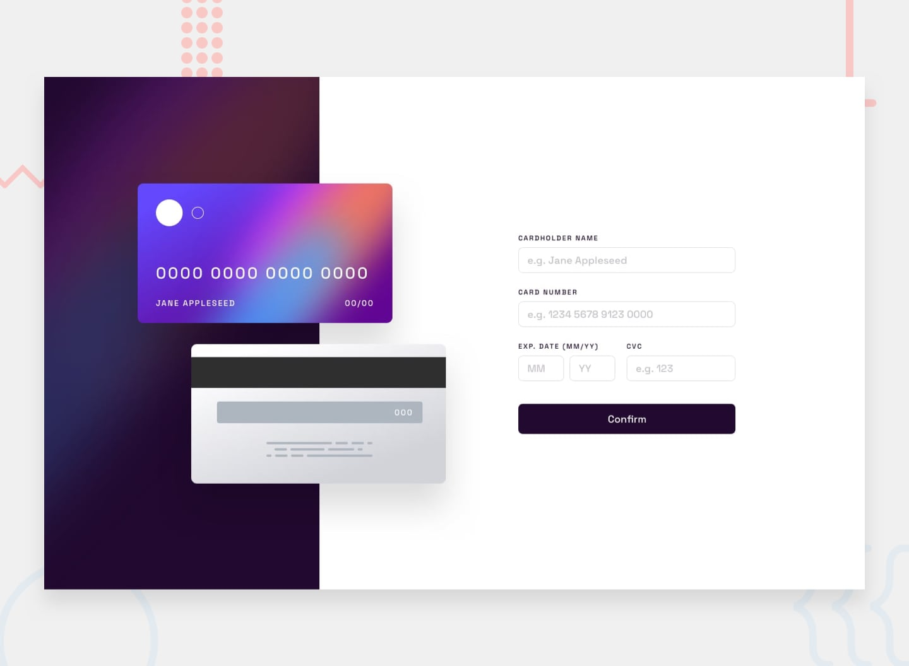

# Interactive Card Details Form

A responsive interactive card details form built as part of a Frontend Mentor challenge.

## Live Demo

[View the live site](https://interactive-card-details-form-azure.vercel.app/)

## Repository

[View the GitHub repository](https://github.com/DevAdeh/Interactive-Card-Details-Form)

## Screenshot

## About the Project

This project recreates an interactive credit card details form from the Frontend Mentor design.

Users can enter their card details and see the information update on the card preview in real time. The form also includes basic validation and a completed state.

## Features

- Responsive design for desktop and mobile screens
- Live card preview
- Card number formatting
- Form validation
- Error messages for invalid or missing fields
- Interactive completed/thank-you state
- Reset functionality
- Accessible form labels and buttons

## Built With

- HTML5
- CSS3
- JavaScript
- CSS Grid
- CSS custom properties
- Responsive design / media queries
- DOM manipulation

## What I Learnt 

While building this project, I practiced:

- Structuring a responsive page with semantic HTML
- Creating layouts with CSS Grid
- Using CSS variables to manage colors
- Working with JavaScript DOM methods
- Listening for user input with event listeners
- Formatting user input with JavaScript
- Validating form fields
- Updating the UI based on user actions
- Creating responsive designs with media queries

## Challenges

One of the main challenges was connecting the form inputs to the card preview.

I had to make sure that when a user entered information, the corresponding card element updated immediately without refreshing the page.

Another challenge was handling validation while keeping the form user-friendly and displaying useful error messages.

## What I Would Improve

If I continued working on this project, I would consider:

- Improving the validation rules
- Adding more detailed accessibility testing
- Making the form interactions even more polished
- Adding automated tests
- Exploring a React version of the project

## Author

**Adeola Ejikunle**

- GitHub: [@DevAdeh](https://github.com/DevAdeh)

## Acknowledgments

- [Frontend Mentor](https://www.frontendmentor.io/) for the challenge and design
